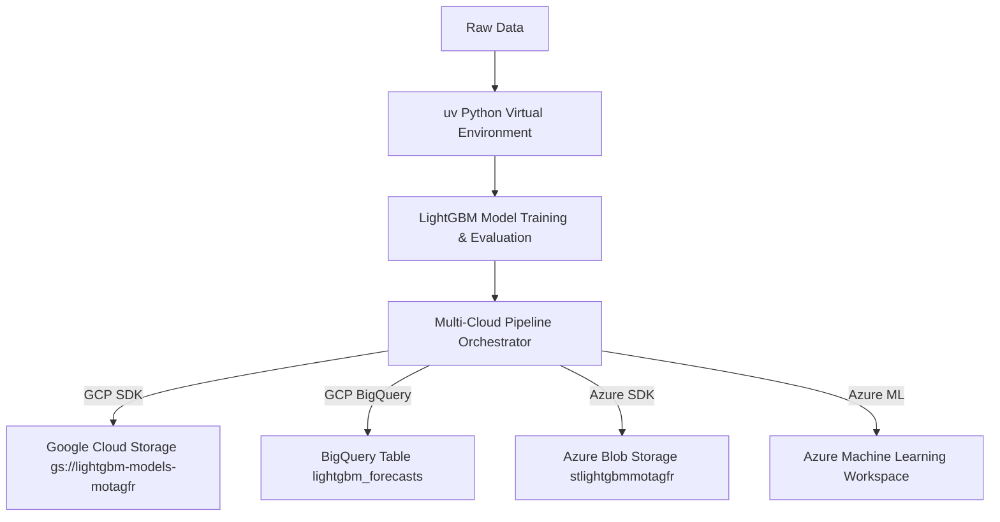

# LightGBM Multi-Cloud Time Series Suite (GCP & Azure)

A high-performance machine learning repository for Data Science and Time Series Forecasting powered by **LightGBM**, **uv**, **Google Cloud Platform (GCP)**, and **Microsoft Azure**.

[](https://github.com/motagfr/lightgbm-time-series/actions)

---

## 🚀 Overview & Multi-Cloud Architecture

This repository demonstrates an enterprise-grade, multi-cloud time series forecasting pipeline designed to deploy model checkpoints, datasets, and predictions across both **Google Cloud Platform (GCP)** and **Microsoft Azure**.



### Features
- ⚡ **Fast & Lightweight Dependency Management**: Powered by `uv` with sub-second lockfile resolution (`uv.lock`).
- 📈 **Advanced Feature Engineering**: Calendar attributes, multi-horizon lags, and rolling window aggregations.
- ☁️ **Dual Cloud Deployment (GCP & Azure)**:
  - **Google Cloud Platform**: GCS Bucket artifact storage & BigQuery streaming predictions.
  - **Microsoft Azure**: Azure Blob Storage container & Azure Machine Learning Workspace integration.
- 🏗️ **Infrastructure as Code (IaC)**: Includes Terraform definitions ([`infrastructure/main.tf`](file:///c:/Users/mtg/Desktop/LightGBM%20Projects/infrastructure/main.tf)) for both GCP and Azure.
- 🔄 **Multi-Cloud CI/CD**: Automated GitHub Actions workflow ([`.github/workflows/cloud_ci_cd.yml`](file:///c:/Users/mtg/Desktop/LightGBM%20Projects/.github/workflows/cloud_ci_cd.yml)).

---

## 🛠️ Quick Start

### 1. Environment Setup with `uv`

Ensure `uv` is installed, then sync the virtual environment:

```bash
# Install all dependencies (LightGBM, GCP SDK, Azure SDK, Optuna, Scikit-Learn)
uv sync

# Run local time-series forecasting demo
uv run python src/forecast_demo.py
```

### 2. Multi-Cloud Pipeline Execution

Run the multi-cloud sync script to export model metrics and artifacts to GCP and Azure:

```bash
# Export to both GCP and Azure
uv run python src/cloud_pipeline.py --provider both

# Export to GCP only
uv run python src/cloud_pipeline.py --provider gcp --gcp-project booming-edge-452110-g8

# Export to Azure only
uv run python src/cloud_pipeline.py --provider azure
```

---

## ☁️ Cloud Infrastructure (Terraform)

Provision both GCP and Azure cloud resources with Terraform:

```bash
cd infrastructure
terraform init
terraform plan
terraform apply
```

### Managed Resources:
- **GCP**: `google_storage_bucket.gcp_model_bucket`, `google_bigquery_dataset.time_series_dataset`.
- **Azure**: `azurerm_resource_group.azure_rg`, `azurerm_storage_account.azure_sa`, `azurerm_storage_container.azure_model_container`, `azurerm_machine_learning_workspace.azure_ml_workspace`.

---

## 💼 Highlighting This Project on Your Resume

Here is how you can describe this project on your resume:

> **Multi-Cloud Time Series Forecasting Suite (GCP & Azure)**  
> *Developed an automated, multi-cloud ML pipeline utilizing LightGBM, `uv`, Google Cloud Platform (GCS, BigQuery), and Microsoft Azure (Blob Storage, Azure ML Workspace).*  
> - Engineered lag and rolling statistics features achieving 4.56% MAPE on out-of-time temporal validation datasets.  
> - Designed Infrastructure as Code (IaC) using Terraform to automate resource provisioning across GCP and Azure.  
> - Implemented GitHub Actions CI/CD pipelines for dual-cloud model artifact persistence and prediction streaming.

---

## 📁 Repository Structure

```
LightGBM Projects/
├── .github/
│   └── workflows/
│       └── cloud_ci_cd.yml      # Multi-Cloud GitHub Actions Workflow
├── .venv/                       # Managed Python virtual environment
├── data/
│   ├── raw/                     # Raw datasets
│   └── processed/               # Feature-engineered Parquet data
├── infrastructure/
│   └── main.tf                  # Terraform IaC for GCP & Azure
├── src/
│   ├── forecast_demo.py         # LightGBM forecasting workflow
│   └── cloud_pipeline.py        # GCP & Azure multi-cloud SDK sync
├── .gitignore                   # Comprehensive git ignore
├── pyproject.toml               # uv project configuration
├── uv.lock                      # Exact dependency lockfile
├── README.md                    # Main repository documentation
├── GUIDE.md                     # Time-series best practices guide
└── CONTRIBUTING.md              # Contribution guidelines
```

---

## 🐙 Repository Links
- **GitHub Repository**: [https://github.com/motagfr/lightgbm-time-series](https://github.com/motagfr/lightgbm-time-series)
